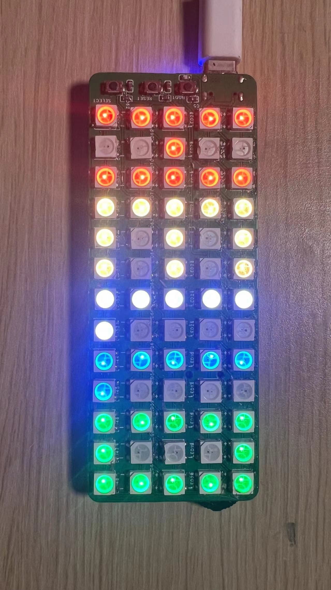
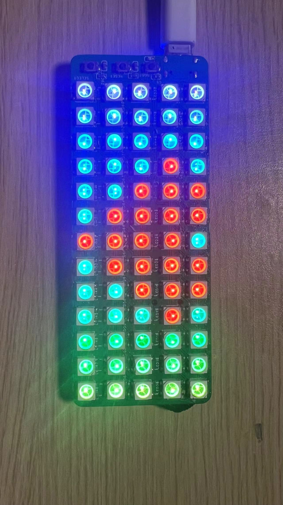
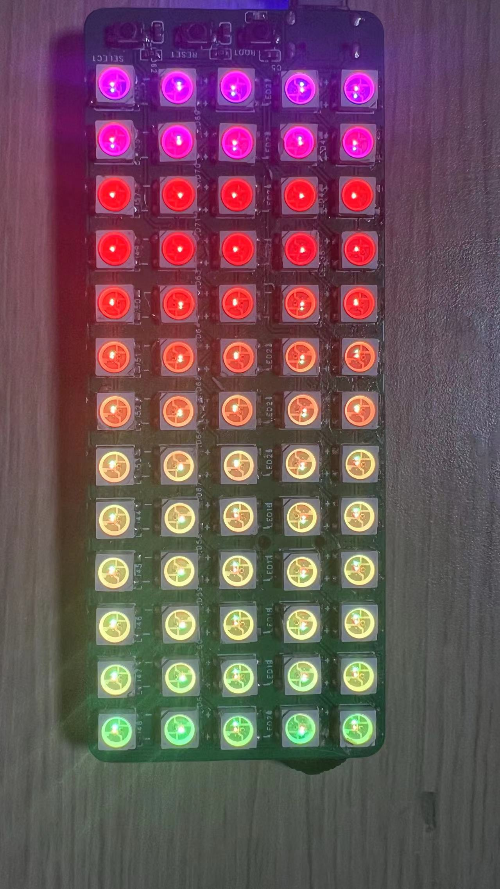
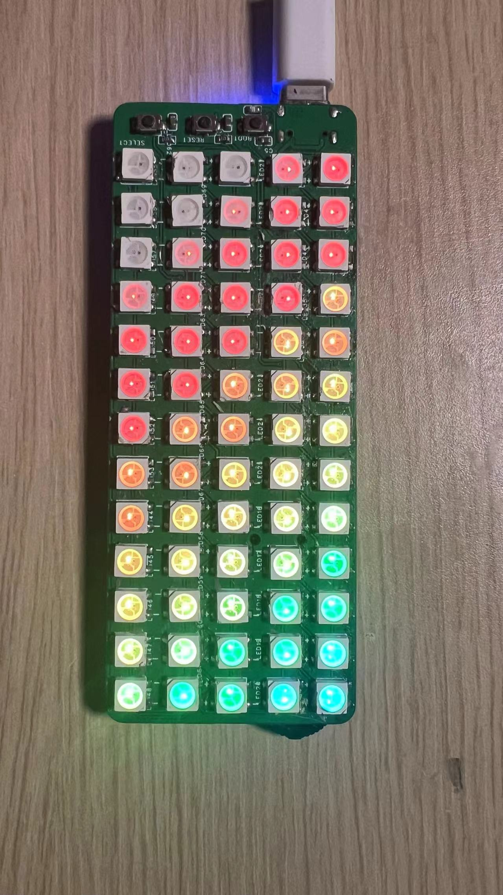
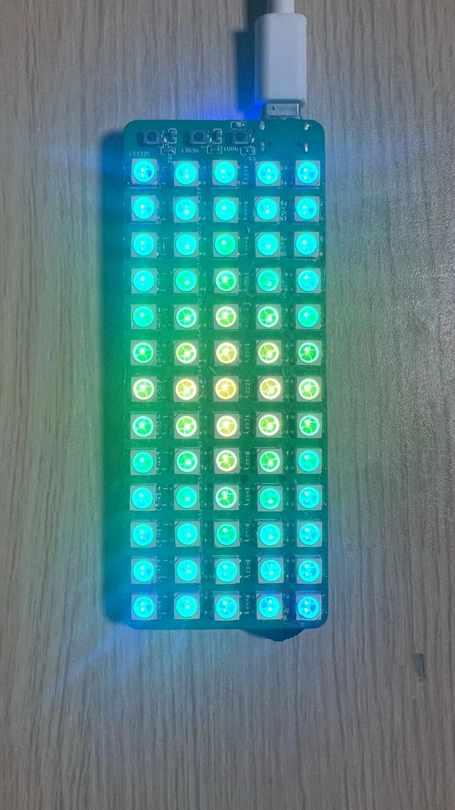

# VFD CLOCK

This project is based on individual changes and corrections made by an open source author, mainly to optimize the code.
[Project link](https://oshwhub.com/MoMoNiZ/Arduino-VFDshi-zhong)

## display

